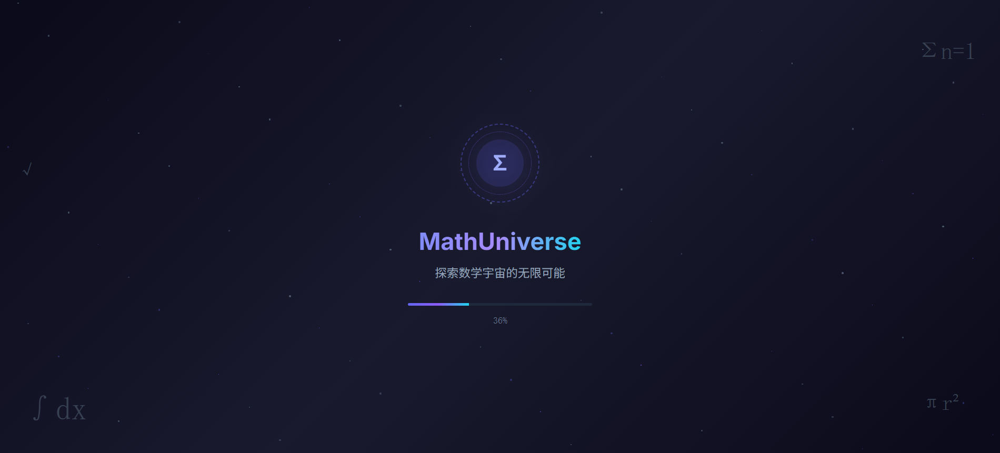
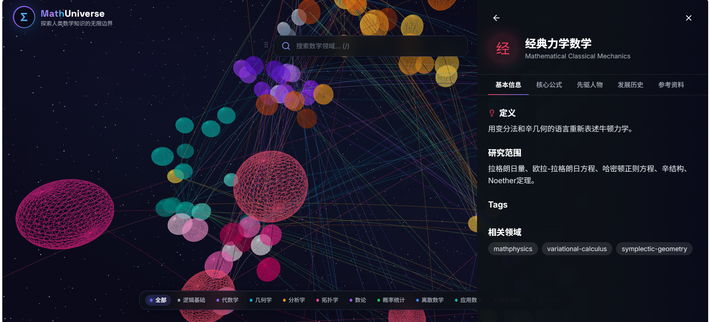
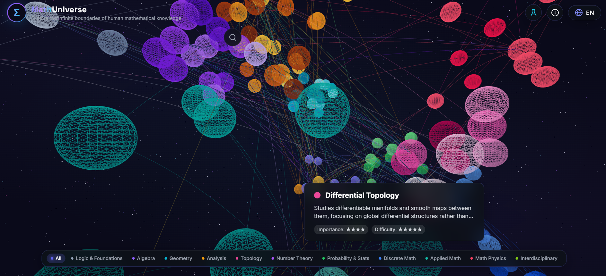

# Vũ trụ Toán học | MathUniverse

**MathUniverse** là ứng dụng tương tác giúp khám phá các khái niệm và lĩnh vực toán học qua không gian 3D.

## Tính năng

- **Mô hình 3D tương tác:** Khám phá các khái niệm toán học trong không gian ba chiều với Three.js và React Three Fiber.
- **Hiển thị công thức:** Xem công thức toán học bằng KaTeX.
- **Chuyển động mượt mà:** Hiệu ứng chuyển động được tạo bằng Framer Motion.
- **Đa ngôn ngữ:** Có giao diện tiếng Việt, tiếng Anh và tiếng Trung.
- **Tương thích nhiều màn hình:** Dùng được trên máy tính, máy tính bảng và điện thoại.

## Ảnh giao diện







## Công nghệ

- React 18 và TypeScript
- Three.js, React Three Fiber và React Three Drei
- Framer Motion và Tailwind CSS
- KaTeX và Lucide React
- React Router DOM và Zustand
- i18next và react-i18next
- Vite

## Cài đặt

```bash
git clone <địa-chỉ-kho-mã>
cd math-universe
npm install
```

## Chạy ứng dụng

```bash
npm run dev
```

Mở địa chỉ `http://localhost:5173` trên trình duyệt.

## Tạo bản dựng

```bash
npm run build
npm run preview
```

## Kiểm tra mã

```bash
npm run lint
```

## Cấu trúc dự án

```text
math-universe/
├── src/
│   ├── components/    # Thành phần giao diện
│   ├── pages/         # Các trang
│   ├── stores/        # Trạng thái ứng dụng
│   ├── i18n/          # Tệp ngôn ngữ
│   └── types/         # Kiểu dữ liệu TypeScript
├── public/            # Tài nguyên tĩnh
└── index.html         # Tệp HTML đầu vào
```

## Đóng góp

Bạn có thể gửi đề xuất hoặc đóng góp mã qua Pull Request.

## Giấy phép

Dự án sử dụng giấy phép MIT. Xem chi tiết trong tệp [LICENSE](LICENSE).

## Cảm ơn

Dự án sử dụng React, Three.js, Vite, Tailwind CSS cùng các thư viện mã nguồn mở khác.

Dự án được phát triển với sự hỗ trợ của [CodeBuddy](https://www.codebuddy.ai/).
